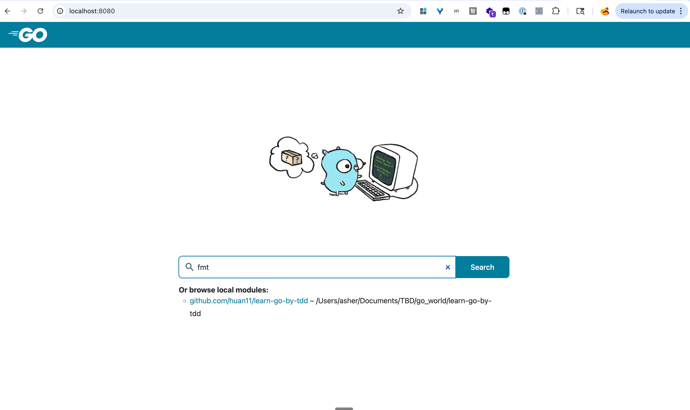
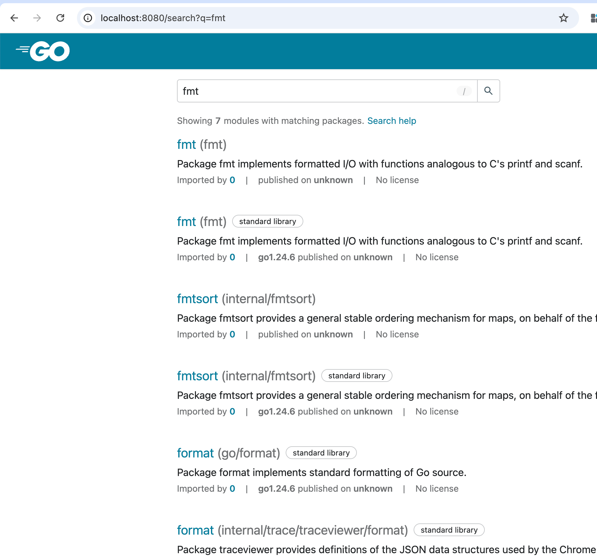

# Lession1 Hello world
First Test : Hello world


## how to query the go document in your local ?

install pkgsite

```bash
go install golang.org/x/pkgsite/cmd/pkgsite@latest
```


open the browser (http://localhost:8080)

>   learn-go-by-tdd git:(main) ✗ pkgsite -open .
> 2025/08/21 20:36:10 Info: go/packages.Load(["all"]) loaded 66 packages from . in 77.684667ms
> 2025/08/21 20:36:11 Info: go/packages.Load(std) loaded 344 packages from /opt/homebrew/opt/go/libexec in 841.996334ms
> 2025/08/21 20:36:11 Info: FetchDataSource: fetching std@latest
> 2025/08/21 20:36:11 Info: FetchDataSource: fetching github.com/huan11/learn-go-by-tdd@v0.0.0
> 2025/08/21 20:36:11 Info: FetchDataSource: fetched github.com/huan11/learn-go-by-tdd@v0.0.0 using *fetch.goPackagesModuleGetter in 1.547375ms with error <nil>
> 2025/08/21 20:36:11 Info: Listening on addr http://localhost:8080
> 2025/08/21 20:36:12 Info: FetchDataSource: fetched std@latest using *fetch.goPackagesModuleGetter in 293.579458ms with error <nil>
> 2025/08/21 20:36:27 Info: FetchDataSource: fetching std@latest
> 2025/08/21 20:36:28 Info: FetchDataSource: fetched std@latest using *fetch.goPackagesModuleGetter in 311.462375ms with error <nil>
> 2025/08/21 20:36:28 Warning: fetching url from deps.dev: Get "https://deps.dev/_/s/go/p/std/v/v1.24.6/exists": context deadline exceeded


open link http://localhost:8080




search


